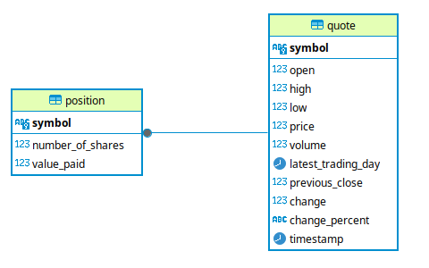

# [Introduction](#introduction)

This Stock Quote application allows users to interact with a PostgreSQL database to manage stock positions. 
Users can retrieve stock quotes, buy and sell shares, and track the value of their portfolio. The Stock Quote application 
retrieves stock data using the Alpha Vantage API, JSON was used to parse the API response. The application is built 
using Java and uses the JDBC for database connectivity and, PostgreSQL as the database. 
Maven is then used to package the project, and Docker for containerization.

## [Quick Start](#quick-start)

#### Docker:

```
# Pull Image from DockerHub
docker pull michaeladebayo/stockquote:latest

# Run the application 
docker run -it --rm --network="host" michaeladebayo/stockquote
```
# [Implementation](#implementation)

## [ER Diagram](#er-diagram)



## [Design Patterns](#design-patterns)

The Stock Quote application uses the DAO  design pattern to manage the interaction between the application and the 
PostgreSQL database. The DAO pattern allows the application to perform CRUD operations on the database while keeping the business logic 
separate from the data access logic.

The QuoteDao and PositionDao classes are both responsible for accessing the quotes and position tables in the database respectively.
By doing this it encapsulates all the operations related to both the Quote and Position entity, which will allow for data modification
without affecting the rest of the code in the application.


# [Test](#test)
The application was tested by setting up a PostgreSQL database and populating it with test data. Manual testing
was done to make sure that the queries were successful. Unit testing and integration were also done on DAO objects and Service objects
by using Mockito and Junit. To test the finished application manual testing was conducted.

# [Deployment](#deployment)
To deploy the application, Docker is used to containerize the application The Docker image was pushed to Docker Hub and can be pulled on 
any machine to run the application. 
The application can be run using the following command:
```
docker run -it --rm --network="host" michaeladebayo/stockquote
```
# [Improvements](#improvements)
- Implement a way to work around the API rate limits.
- Add more fields to the position table, for more details on stocks bought.