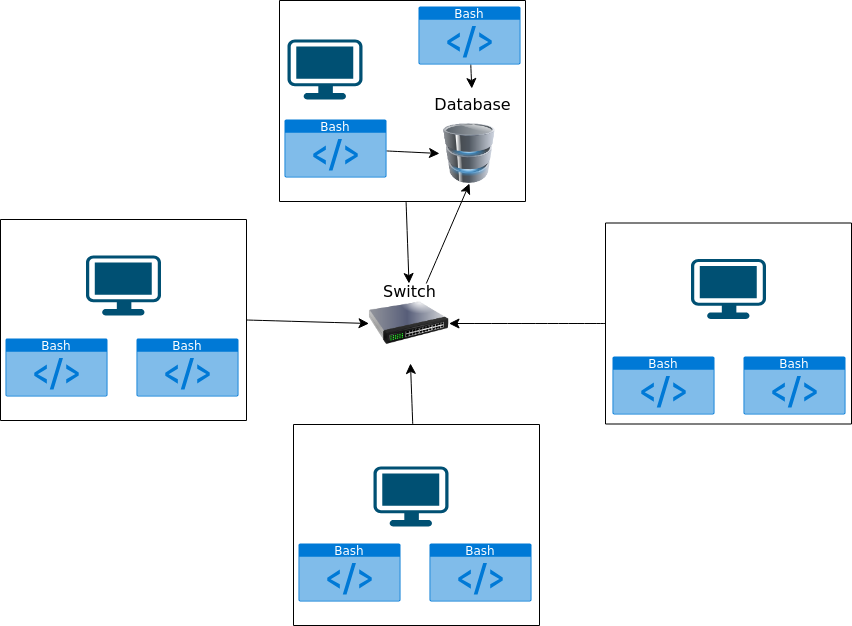

# [Introduction](#introduction)
This project has the goal of creating scripts that will be able to collect hardware data and resource
usage data, that will enable the Jarvis Linux Cluster Administration to determine how they can properly
manage resources from a cluster. To run the scripts the Linux command line interface was used, and bash scripts
gathered the data and stored it into psql database, it was run on a docker container. Real VNC was used to view
the machine and was hosted on GCP on the cloud and git was used for version control.

## [Quick Start](#quick-start)

1. **Create a psql instance using psql_docker.sh**:
   ``` ./scripts/psql_docker.sh create "user_name" "password"```
- **Start a psql instance using psql_docker.sh**:
  ``` ./scripts/psql_docker.sh start ```
2. **Create tables using ddl.sql**:
   Once the database and containers are created you can then use ddl.sql to create the tables
   ``` psql -h "host_name " -U "user_name" -d "database_name" -f sql/queries.sql ```
3. **Insert hardware specs data into the DB using host_info.sh**: ``` ./scripts/host_info.sh "host" "port" "db_name" "user_name" "psql_password"```
4. **Insert hardware usage data into the DB using host_usage.sh**:``` ./scripts/host_usage.sh "host" "port" "db_name" "user_name" "psql_password"```
5. **Crontab setup**:
``` 
 #In bash 
 crontab - e
 
 * * * * * bash ./scripts/host_usage.sh "host" "port" "db_name" "user_name" "psql_password" > /tmp/host_usage.log

# List crontab process
crontab -l
```

## [Implementation](#implementation)

The implementation of this project required a docker container to be created and then started, as well as
a volume to be created and attached to an image. Two tables would then be created, "host_info" which stores
the hardware information about the current machine, and "host_usage" which will store the resources running
the current machine. Crontab was then implemented so that "host_usage" would run every one minute and be inputted
into the "host_usage" table.

## [Architecture](#architecture)



## [Scripts](#scripts)

1. **psql_docker.sh**:
- This script is used to create a docker container and image, as well as create the databases
``` 
./scripts/psql_docker.sh create "user_name" "password"

# Start container
./scripts/psql_docker.sh start 

# Stop container
./scripts/psql_docker.sh stop
```

2. **host_info.sh**:
    - This script is used to input the hardware information of the current machine into the host_info table
      ```./scripts/host_info.sh "host" "port" "db_name" "user_name" "psql_password"```
3. **host_usage.sh**:
- This script is used to input the resource information of the current machine into the host_usage table
  ``` ./scripts/host_usage.sh "host" "port" "db_name" "user_name" "psql_password"```
4. **crontab**:
- This script will allow host_usage to run every minute and then store the results of the process in a log file
```
#To open up editor
 crontab - e
 
 * * * * * bash ./scripts/host_usage.sh "host" "port" "db_name" "user_name" "psql_password" > /tmp/host_usage.log
```

## [Database Modeling](#database-modeling)
### host_info Table Schema
| Name             | Type      | Description                            |
|------------------|-----------|----------------------------------------|
| id               | Serial    | Unique ID for each host                |
| hostname         | Varchar   | Name of host                           |
| cpu_number       | Int       | The number of CPU(s)                   |
| cpu_architecture | Varchar   | The architecture of the CPU(s)         |
| cpu_model        | Varchar   | The model of the CPU(s)                |
| cpu_mhz          | Float     | The clock speed of the CPU             |
| l2_cache         | Int       | The cache size                         |
| timestamp        | Timestamp | Time of when data was collected        |
| total_mem        | Int       | Total memory available on this machine |


### host_usage Table Schema
| Name            | Type      | Description                     |
|-----------------|-----------|---------------------------------|
| timestamp       | Timestamp | Time of when data was collected |
| host_id         | Serial    | Unique ID for each host         |
| memory_free     | Int       | Total memory that is available  |
| cpu_idle        | Int       | The CPU idle time               |
| cpu_kernel      | Int       | The CPU kernel time             |
| disk_io         | Int       | The number of disks operations  |
| disk_available  | Int       | The space available in the disk |

## [Test](#test)
The test of the bash scripts was done manually, I first tested ```./psql_docker.sh ``` I used all three
commands of : start, stop and create to ensure that it worked properly. I tested **ddl.sql** by running the script with empty
database and then confirming that the tables were created with the right data types as well. For **host_info.sh** and **host_usage.s**
I tested both scripts to make sure that both tables were populated with the correct information. Finally, I created
the automation with **crontab** and created a log file to collect it's output, I verified that crontab was working using
the ``` crontab -l``` command.

## [Deployment](#deployment)
The deployment of this app was done through this GitHub repository the app is hosted in a Docker container,
with a Docker volume used to store persistent data, with crontab used for automation of data collection.

## [Improvements](#improvements)

- Create notifications if certain goals have been reached or have fallen below expectations
- Enhance the efficiency of the scripts
- Develop an interface for accessing and analyzing the data