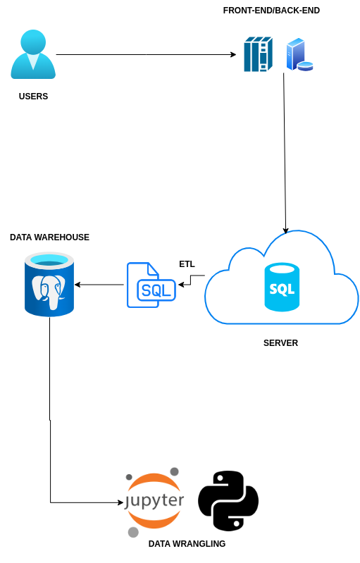

# [Introduction](#introduction)
This project had the goal to help analyse data about customers from The London Gift Shop to help the marketing team understand customer
behaviour which will allow for targeted marketing. The London Gift Shop (LSG) has been stagnant in its revenue growth, the marketing team want's to figure out
why and find possible solutions. Through data given on a sql file, data was hosted on a Postgres database, I was able
to use Jupyter Notebook and Python with Pandas being used for me to extract and work with the customer data and Matplotlib was used to
help me visualize the data.

# [Implementation](#implementation)
## Project Architecture
The architecture of this project involves several key components:

Data Collection: Customer transaction data is collected from LGS's online store, which includes the invoice number, invoice date, stock codes, 
description, quantity, price, and customer IDs.

Data Wrangling: The raw data is cleaned and transformed into a format suitable for analysis. This includes handling missing values, 
removing duplicates, and converting date formats, changing naming convention.

RFM Segmentation: The cleaned data is used to calculate RFM scores for each customer, identifying how recently a customer purchased 
, how often they purchased, and how much they spent . These scores are then used to segment the customer 
base into groups.

Marketing Strategy: Based on the RFM segmentation, marketing strategies are implemented for each customer segment to boost 
engagement and sales.

# [Architecture Diagram](#architecture-diagram)

## Data Analytics and Wrangling
You can view the detailed data analytics and wrangling process in the Jupyter Notebook [here](./retail_data_analytics_wrangling.ipynb).

By analyzing the customer data, LSG can design marketing strategies to target specific customer segments.
For example based on the three segmentations of Champions, Hibernating and Can't lose, I would suggest a targeted marketing for each
of these segments:

- **Champions**: These are the most valuable customers who shop frequently and spend the most with an average of £10,000 .LGS can focus on loyalty programs, 
exclusive discounts, for this group to retain them.

- **Hibernating**: Customers who haven’t shopped in a while with an average spent of £438 and an average of 481 days between purchases could be targeted with reactivation marketing, offering them 
personalized discounts and special offers waiting them.

- **Can't Lose**: Customers who have been loyal in the past but haven't shopped recently with an average of 353 days before purchases could 
receive a huge one time discount on any item their interested in, this can lure them back.

# [Improvements](#improvements)
If I had more time, these are some of the improvements I would make:

- Find out where customers are making their orders and rge time of day orders are being places 

- Automate reports that will include the most up-to date information about customers that the marketing team can use.

- Find out which items were sold the most and least in each of the segmentations.